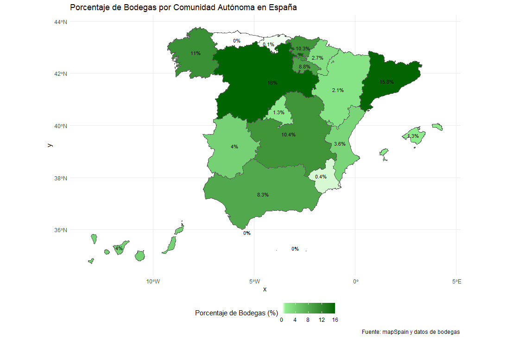
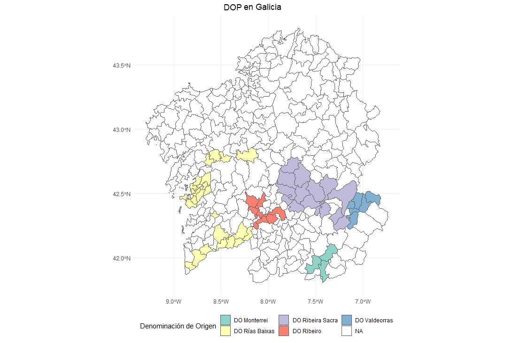
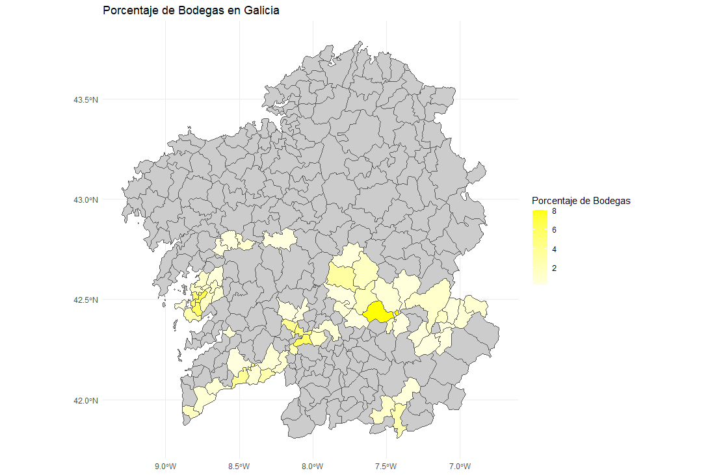
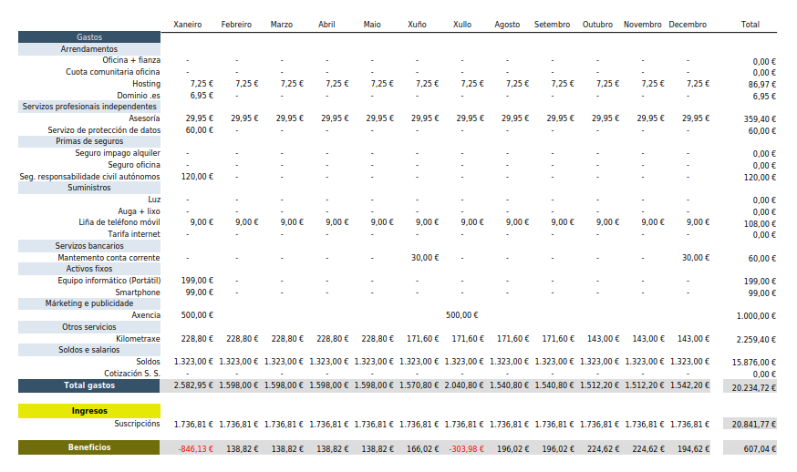
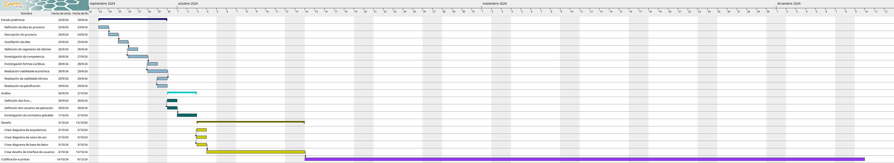

# Anteproxecto fin de ciclo

- [Anteproxecto fin de ciclo](#anteproxecto-fin-de-ciclo)
  - [1- Descrición do proxecto](#1--descrición-do-proxecto)
  - [2- Empresa](#2--empresa)
    - [2.1- Idea de negocio](#21--idea-de-negocio)
    - [2.2- Xustificación da idea](#22--xustificación-da-idea)
    - [2.3- Segmento de clientes](#23--segmento-de-clientes)
    - [2.4- Competencia](#24--competencia)
    - [2.5- Proposta de valor](#25--proposta-de-valor)
    - [2.6- Forma xurídica](#26--forma-xurídica)
    - [2.7- Investimentos](#27--investimentos)
      - [2.7.1- Custos](#271--custos)
      - [2.7.2- Ingresos](#272--ingresos)
    - [2.8- Viabilidade](#28--viabilidade)
      - [2.8.1- Viabilidade técnica](#281--viabilidade-técnica)
      - [2.8.2 - Viabilidade económica](#282---viabilidade-económica)
      - [2.8.3- Conclusión](#283--conclusión)
  - [3- Requirimentos técnicos](#3--requirimentos-técnicos)
  - [4- Planificación](#4--planificación)

## 1- Descrición do proxecto
O proxecto consiste na creación dunha aplicación web para xestionar a información relativa aos proveedores de uva dunha empresa vitivinícola dando servizo a aquelas que non contan cun software específico que intercambie información cos seus proveedores, sendo o seu propósito principal establecer unha vía de comunicación e consulta de información.

Os obxectivos específicos do proxecto son:
- Manter ao proveedor informado en todo momento dos datos de facturación coa empresa.
- Consultar información relacionada coa rendibilidade productiva das parcelas. 
- Consultar información sobre as facturas pendentes de pagar dos proveedores e dos ingresos que ten que abonar a empresa, así como a descarga das mesmas.
- Consultar a nomativa do proceso de entrega de uva xunto cos días asignados de vendima e as caixas que lle corresponden aos proveedores.

Para a comercialización da aplicación precisarase dos seguintes recursos: 
- Un servidor capaz de aloxar a aplicación, no que se instalará o servidor web Apache, a base de datos MySQL e a linguaxe de servidor PHP.
- Un subdominio no dominio web da empresa. Se a empresa non ten un dominio propio proporcionarase o servizo para contratar un.

Ademáis, para que o cliente poida utilizar a aplicación será preciso que conte cunha licenza da aplicación elixindo para elo calquera dos plans que se lle ofertarán: freemium ou suscripción.
 
As tecnoloxías utilizadas para a realización do proxecto son: PHP, JavaScript, HTML e SASS.

## 2- Empresa

### 2.1- Idea de negocio
A aplicación web mostra información a tempo real referente aos proveedores de uva dunha empresa vitivinícola a través da súa páxina web proporcionando un medio de comunicación entre a empresa e os seus proveedores de uva sen que estes teñan que ir presencialmente á empresa para pedir información.

O valor engadido da aplicación radica:
- **Plataforma independente:** os usuarios non necesitan instalación ningunha, podendo acceder á aplicación dende calquer lugar con conexión a internet e mediante calquer dispositivo como unha tableta, un móvil ou unha computadora.
- **Non require instalación para a súa implantación:** a aplicación non require instalación para o cliente xa que se provee a aplicación xunto coa súa implantación.
- **Centralización de datos:** Ao centralizar os datos na aplicación, tódolos usuarios poden acceder á última versión deles sen necesidade de estar pendentes de se os datos facilitados na bodega son correctos.
- **Redución dos custes de desenvolvemento:** os custes do desenvolvemento dun software específico son afrontados sempre polo cliente que o encargou, facendo que este software sexa moi caro para o cliente, pero neste caso o desenrolo da aplicación pode ser empregado por moitos clientes permitindo reducir o custe do uso da mesma para eles.
- **Aforro en infraestructura:** para a utilización da aplicación non é necesario ter un servidor propio poidendo aloxar a aplicación nun servidor na nube compartido con outros clientes.
- **Acceso simultáneo:** moitos usuarios poden acceder á aplicación á vez.

### 2.2- Xustificación da idea
A idea xorde da necesidade do intercambio de datos entre as empresas vitivinícolas e os seus proveedores de uva facilitando a consulta dos datos de facturación coa bodega a tempo real sen ter que desprazarse presencialmente os proveedores de uva para solicitar esta información. Ademáis, a aplicación, permite realizar pequenas xestións como a descarga das facturas e ingresos ou consultar a información referente á campaña da vendima.

O software empregado polas grandes empresas vitivinícolas é mais completo de xeito que, para os clientes, adoita ter un módulo que conecta a base de datos da empresa cunha páxina web, pero non teñen este servizo para os proveedores e o software das pequenas empresas é mais modesto, de tal forma que non ofertan estes servizos.

Na actualidade, as aplicacións que existen céntranse en mellorar a comunicación entre a empresa e os seus clientes, pero esquécense das relacións cos seus proveedores. Esta aplicación pretende mellorar esas relacións mediante o intercambio de información das transaccións económicas dos proveedores coas empresas vitivinícolas permitindo consultar esa información en tempo real.

<u>**Análise DAFO**</u>

| Fortalezas |  | Oportunidades |
| --- | --- | --- |
| Custos baixos de implantación do software para o cliente| | Posibilidade de expandir a aplicación cara outros sectores |
| Personalización do software | | Posibilidade de expansión cara outras empresas do sector agrícola | 
| A aplicación cubre unha necesidade sen cubrir das empresas | | Dixitalización das empresas que buscan aplicacións e solucións informáticas.

| Debilidades |  | Ameazas |
| --- | --- | --- |
| Falta de experiencia | | Empresa vulnerable ante grandes competidores |
| Empresa nova no sector | | Facilidade de entrada de novos competidores no mercado |
| Escasa imaxe de marca | | Dificultade para obter financiación bancaria |

### 2.3- Segmento de clientes
O sector vitivinícola en España representa aproximadamente entre o 1% e o 1,5% do Producto Interior Bruto (PIB), xerando emprego directo e indirecto nas áreas da agricultura, producción, distribución e turismo, xa que as adegas que operan baixo as denominacións de orixe non só producen viño, senón tamén atraen a turistas mediante experiencias gastronómicas que promocionan o viño ofrecendo visitas a viñedos e adegas e consumindo o viño realizado nas mesmas mediante catas, o que potencia aínda máis o seu impacto económico.

Segundo datos do "*Ministerio de Agricultura, Pesca y Alimentación*" na [campaña 2022/2023](https://www.mapa.gob.es/es/alimentacion/temas/calidad-diferenciada/informe_dops_2022_2023_tcm30-690956.pdf), en España, hai un total de 4.015 bodegas que pertencen a unha das 68 denominacións de orixe que existen.

  
_Figura 1. Mapa da porcentaxe de adegas vitivinícolas das denominacións de orixe por comunidades autónomas en España._  
_Fonte: Elaboración propia (2024) a partir de datos das DO._

Do total de bodegas de España, en Galicia están ubicadas 442 bodegas pertencentes a 5 denominacións de orixe: DO. Rías Baixas, DO. Valdeorras, DO. Ribeiro, DO. Ribeira Sacra e DO. Monterrei.

  
_Figura 2. Mapa da ubicación xeográfica das denominacións de orixe de Galicia._  
_Fonte: Elaboración propia (2024) a partir de datos do "Ministerio de Agricultura, Pesca y Alimentación"._

A empresa está ubicada no concello de Vilagarcía de Arousa, que pertence á denominación de orixe Rías Baixas, na que están asociadas un total de 178 adegas. Por este motivo, decidíuse que as adegas localizadas nesta denominación sexan os potenciais clientes da empresa e os seus proveedores de uva os usuarios da aplicación.

  
_Figura 3. Mapa da porcentaxe de bodegas de Galicia das Denominacións de Orixe por concellos._  
_Fonte: Elaboración propia (2024) a partir de datos da Xunta de Galicia._

### 2.4- Competencia
Actualmente, as grandes empresas vitivinícolas utilizan un ERP, que é un software que permite centralizar nunha única base de datos todos os procesos da empresa de xeito realízase unha xestión unificada das áreas da empresa.

Un ERP está composto por módulos que xestionan as diferentes áreas da empresa onde cada empresa selecciona os módulos que son necesarios e se adaptan a ela. Entre os seus módulos adoita haber un que comunica a base de datos cun servidor web para realizar a xestión dunha tenda electrónica. Este tipo de servizo soe estar centrado nos clientes, de xeito que éstes poden consultar información a través da páxina, como os pedidos realizados, as facturas emitidas, a xestión de reclamacións,... etc, pero non acostuman ter esta comunicación cos proveedores.

Os principais ERPs que hai no mercado son: SAP, Oracle, Microsoft e Odoo, aínda que existen algúns ERP españois como Navision e Axapta.

Nas pequenas e medianas empresas adoian ter software máis sinxelo que non ofertan servizos de intercambio de información entre a empresa e os seus proveedores.

### 2.5- Proposta de valor
O principal obxectivo das empresas é a comunicación cos seus clientes, mentres que o propóstito desta aplicación é mellorar a comunicación das empresas vitivinícolas cos seus proveedores de uva. A través da nosa aplicación, os proveedores de uva poderán estar informados en todo momento sobre os seus datos financeiros e da vendima que teñen coa bodega. Ademáis, a través da aplicación, poderán descargar toda a documentación da bodega como as facturas, os albaráns de entrega da uva,... e consultar información como a normativa da vendima, as datas de comezo e remate da vendima, ... sen ter que acudir persoalmente o proveedor ás instalacións da empresa.

### 2.6- Forma xurídica
A forma xurídica escollida é autónomo debido a que non se necesita capital inicial para constituir a empresa e os únicos trámites que hai realizar é darse de alta no "Régimen Especial de Trabajadores Autónomos" na Seguridade Social e darse de alta no "Centro de Empresarios" na Axencia Tributaria.

Ademáis, debido a que se cumpren os requisitos para a subvención "Cuota cero" dirixida ás persoas que emprenden por primeira vez estaremos exentos de pagar a cota a seguridade social de autónomos durante 12 meses prorrogables por outros 12 meses se temos rendementos netos inferiores ao Salario Mínimo Interprofesional (SMI).

### 2.7- Investimentos
Debido a que a empresa é de nova creación, decidiuse ubicar no viveiro de empresas do IES Armando Cotarelo Valledor porque proporciona unhas instalacións e servizos de carácter gratuíto que, ademáis, conta con asesoramento profesional e personalizado. Ademáis, o viveiro inclúe servizos como a luz, auga, mobiliario, equipos informáticos e internet o que permite aforrar nos gastos de lixo, aluguer do local, seguro de impago do aluguer e seguro da oficina. Ademáis, co fin de poder traballar fóra da oficina decidiuse adquirir un ordenador portátil valorado en 199€.

Para a comunicación entre a empresa e os seus clientes, a máis de medios dixitais, optouse por contratar unha liña de teléfono para empresas cun custo de 12'40€ ao mes e adquirir un teléfono móvil cun custo de 99€.

Para aloxar a páxina web da empresa e as aplicacións dos clientes decidiuse, entre os tipos de aloxamento web ofertados, contratar un hosting de servidor privado virtual (VPS) que custa 7,25€ ao mes (IVA incluído) e un dominio para a empresa, que custa uns 6.95€ ao ano (dominio .es).

Así mesmo, aínda que non é obrigatorio, decidíuse contratar un seguro de responsabilidade civil para autónomos que cubre os posibles danos tanto persoais como materiais que poida causar a actividade a terceiras persoas de xeito involuntario que ten un custe duns 120€ ao ano.

Para levar a cabo as tarefas de xestión administrativa da empresa, optouse por contratar os servizos dunha asesoría online, que ten un custo de 29'95€ ao mes. Ademáis, como a empresa garda datos dos clientes, é obrigatorio ter un servizo de protección de datos que ten un custo de 60€ ao ano.

E por último, para a xestión dos pagos e cobros da empresa contratouse unha conta corrente de autónomos cun custe de mantemento de 30€ cada seis meses.

#### 2.7.1- Custos
| Investimentos: | | |
| --- | --- | ---: |
| [Equipo informático](img/Prezo_portatil.png)  | | 199€
| [Teléfono móvil](img/Prezo_smartphone.png) | | 99€

| Custos fixos (prezo anual): | | |
| --- | --- | ---: |
| [Dominio web](img/Prezo_dominio.png) | | 6,95 €
| Servizo de protección de datos | | 60,00 €
| Seguro responsabilidade civil de autónomos | | 120,00 €
| Gastos bancarios | |  60,00 €
| [Hosting](img/Prezo_hosting.png) | | 86,97 €
| [Liña de teléfono](img/Prezo_tarifa_telefono.png) | | 108,00 €
| [Asesoría](img/Prezo_asesoria.png) | | 359,40 €
| Cotización á Seguridade Social | | 0,00 €
| Soldos | | 15.876,00 €

| Custos variables:  | | |
| --- | --- | ---: |
| Kilometraxe | | 2.259,40 € |
| Márketing e publicidade | | 1.000,00 € |

En total a empresa, o primeiro ano, ten uns gastos anuais de 20.234,72€.

#### 2.7.2- Ingresos
A comercialización da aplicación realizarase mediante a selección, por parte do cliente, dunha das licenzas ofertadas:
- Freemium: plan onde os clientes poden utilizar a aplicación gratuitamente durante un período de tempo dun mes.
- Por suscripción: plan onde os clientes deben retribuir o prezo do mesmo a cambio de poder utilizar o software durante o período de tempo contratado. Deste plan ofertarase a contratación da licenza durante un ano, dous anos ou cinco anos.

A obtención da licenza por parte do cliente non implica a cesión da propiedade do software aos mesmos e estes non poden seguir utilizándoo no caso de non renovar a suscripción.

Para cada mes, a empresa fíxase como obxectivo ter 6 novos clientes, de forma que ao ano tería uns 72 clientes.

Para calcular o prezo da aplicación utilizouse a seguinte fórmula:
$$\text{Prezo} = \frac{\text{total custos}} {\text{número de clientes obxectivo dun ano}} + 5\% \text{de ganancias} = \frac{\text{20.234,72 €}}{\text{72}} \times 5\%  = 24,12€$$

Polo tanto, o prezo da aplicaclión é de 24,12€ ao mes sendo o custo dun ano uns 289,37€. En función do tempo contratado polo cliente, o prezo final da aplicación sería o prezo dun ano multiplicado polos anos contratados polo o cliente. Ademáis, no caso de que o cliente non tivera un dominio para aloxar a web, engadiríaselle o prezo da contratación do dominio.

### 2.8- Viabilidade

#### 2.8.1- Viabilidade técnica
Para poñer en marcha este proxecto son necesarios os seguintes recursos:
 1. Tecnoloxías utilizadas: PHP, JavaScript, HTML, SASS e MySQL.
 2. Recursos dispoñibles: técnico/a en desenvolvemento de aplicacións web, un servidor na nube, ferramentas de entorno de desenvolvemento integrado como VSCode, equipo informático, servidor web, servidor de base de datos, local e mobiliario de oficina.
 3. Integración con sistemas existentes como APIs.
 4. Tempo de desenrolo da aplicación: 500 horas.
 5. Seguridade: copias de seguridade, tanto do sistema como da base de datos, control de incidencias mediante o acceso aos logs do sistema e do servidor web.

O proxecto é viable dende o punto de vista técnico xa que conta cos recursos necesarios para o correcto funcionamento da actividade.

#### 2.8.2 - Viabilidade económica
Segundo os datos aportados nos apartados anteriores, pode levarse á cabo unha táboa que recolle a previsión de ingresos e gastos da empresa durante o primeiro ano.
  
_Táboa 1. Previsión de ingresos e gastos da empresa durante o primero ano._  
_Fonte: Elaboración propia (2024)._

Dos datos anteriores pódese deducir o seguinte:
- A inversión inicial da empresa é de 2.582,95€.
- O primeiro ano a empresa ten os seguintes gastos:
  - Gastos fixos duns 1.598€ ao mes, excepto nos meses de xuño e decembro nos que se engade o custo da comisión de mantemento da conta bancaria, que corresponden cos seguintes gastos:
    - Aloxamento web.
    - Asesoría.
    - Liña de teléfono.
    - Soldos.  
   - Gastos variables de 3.259,40€ ano ano que corresponden cos gastos do kilometraxe e da publicidade. 
- As cifras de vendas son estables durante todo o ano debido a que a empresa marcouse un obxectivo de 6 novos clientes cada mes, polo tanto a empresa ten uns ingresos totais de 20.841,77€. 

Disto conclúese que non hai problemas de liquidez que motiven a utilizar fontes de financiación externa xa que, en cada un dos meses do ano os ingresos son maiores ca os gastos, excepto no primeiro mes debido á inversión inicial da posta en marcha empresa e no mes de xullo debido á invesión en publicidade.

#### 2.8.3- Conclusión
Segundo os datos explicados no apartado anterior, a empresa ao final do primeiro ano, ten uns gastos totais de 20.234,72€ e uns ingresos totais de 20.841,77€. 

Polo tanto a empresa é viable técnicamente, porque conta cos recursos necesarios para realizar a actividade, e económicamente debido a que, ao final do primeiro ano, ten uns beneficios de 607,04€.

## 3- Requirimentos técnicos
- **Infraestructura:** 
  - Dominio web.
  - Hosting de servidor privado virtual (VPS):
    - Almacenamento: 50 GB de espazo en disco.
    - Memoria: 4GB RAM.
  - Servidor web Apache.
  - Servidor de base de datos MySQL.
- **Backend:** 
  - PHP.
- **Frontend:** 
  - JavaScript
  - HTML
  - SASS.

## 4- Planificación
  
_Figura 4. Diagrama de Gantt coa planificación do proxecto._  
_Fonte: Elaboración propia (2024)._

1. Estudo preliminar --> 23/09/24 - 29/09/24  
   Realización das seguintes tarefas:
   - Definición da idea do proxecto.
   - Investigación da competencia.
   - Investigación da viabilidade ecónomica e técnica do proxecto.
  
2. Análise --> 30/09/24 - 02/10/24  
   Realización das seguintes tarefas:
   - Definición das funcionalidades e usuarios da aplicación.
   - Investigación da normativa aplicable ao software.
    
3. Deseño --> 03/10/24 - 16/10/24  
   Realización das seguintes tarefas:
   - Realización dos diagramas de arquitectura, casos de uso e bases de datos da aplicación.
   - Realización do deseño das interfaces de usuario da aplicación.
   
4. Codificación e probas --> 17/10/24 - 09/12/24  
   Realización da codificación do proxecto e as probas necesarias para comprobar o seu correcto funcionamento.
